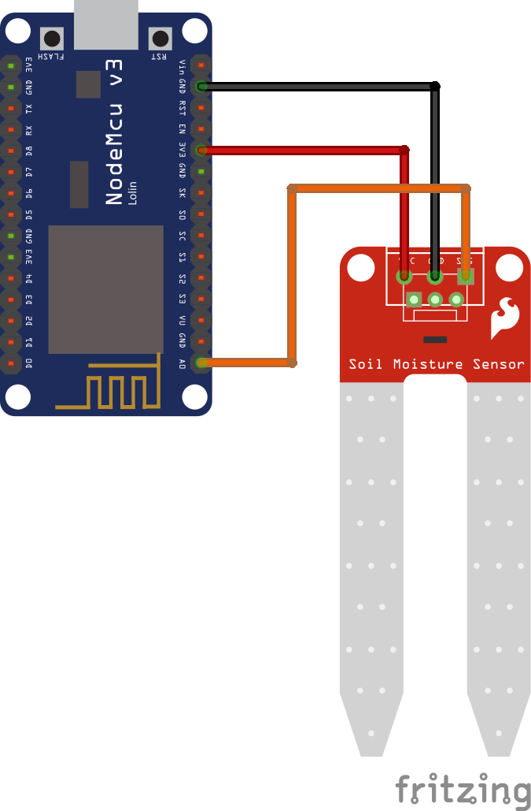

## Hardware

### Required components
* ESP8266 ESP-12E ([Amazon](http://www.amazon.de/dp/B06Y1LZLLY/))
* Moisture sensor ([Amazon](http://www.amazon.de/dp/B075K94S5D/))

### Schematics


## Software

IDE: [Arduino](https://www.arduino.cc/en/Main/Software)

### Dependencies
* ESP8266 Board ([Github](https://github.com/esp8266/Arduino))
* PubSubClient 2.6.0 ([Github](https://github.com/knolleary/pubsubclient))
* ArduinoJson 5.13.3 ([Github](https://github.com/bblanchon/ArduinoJson))
* WifiManager 0.14.0 ([Github](https://github.com/tzapu/WiFiManager))

## Installation

1. Install Arduino IDE from link above
1. Add ESP8266 Addon (See tutorial from [Sparkfun](https://learn.sparkfun.com/tutorials/esp8266-thing-hookup-guide/installing-the-esp8266-arduino-addon))
1. Install all dependencies with library manager
   * *Sketch > Include Library > Manage Libraries*
   * Search for each dependency (see list above) exept ESP8266 Board and install the appropriate versions.
1. Download this repository and open it with the IDE
1. Enter the `name`, `type` and `location` of the sensor:
    ````
    #define sensor_name "......"
    #define sensor_type "......"
    #define sensor_location "......"
    ````
1. Configure actors: (pin, 0, top of actor)
    ````
    actor_type actors[] = {
      // {D0, 0, "actor.<location>.<actor name 1>"},
      // {D1, 0, "actor.<location>.<actor name 2>"}
    };
    ````
1. Connect ESP8266 to the computer
1. Select the board from *Tools > Board > NodeMCU 1.0 (ESP-12E Module)*
1. Select the COM port where ESP8266 is connected *Tools > Board > Port > COMxx*
1. Push `RST` and `FLASH` button, release `RST` and then release `FLASH`
1. Flash the firmware from the Arduino IDE
1. The microcontroller will create a new access point. Connect there and navigate with a browser to `192.168.4.1`.
1. Provide in the webinterface the SSID and password for your network.